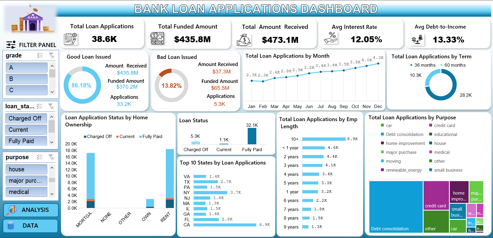

# 📊 Bank Loan Applications Analysis Dashboard (Excel)

## 🔍 Project Overview
This project focuses on analyzing bank loan application data using **Microsoft Excel**.  
An interactive dashboard was built to evaluate loan performance, borrower behavior, and credit risk using real-world business metrics.

---

## 📌 Key KPIs
- Total Loan Applications  
- Total Funded Amount  
- Total Amount Received  
- Average Interest Rate  
- Average Debt-to-Income (DTI) Ratio  

---

## 📈 Dashboard Features
- Good Loan vs Bad Loan analysis  
- Monthly trend of loan applications  
- Loan term distribution (36 vs 60 months)  
- Employment length vs loan applications  
- Top states by loan applications  
- Loan purpose analysis using treemap  
- Fully interactive slicers for dynamic filtering  

---

## 📷 Dashboard Preview

---

## 🎥 Interactive Dashboard Demo (Video)
A short screen recording demonstrating:
- Slicer-based filtering  
- Dynamic KPI updates  
- Interactive Excel dashboard behavior  

👉 **Watch the demo video here:**  
https://drive.google.com/file/d/1movkWjukjSeHFhtyZ6lXoJNcDk51TZWJ/view?usp=drive_link

---

## 🛠 Tools & Techniques Used
- Microsoft Excel  
- Pivot Tables & Pivot Charts  
- Slicers for interactivity  
- Data Cleaning & Data Analysis  
- Business Insights & Data Visualization  

---

## 📊 Key Insights
- Approximately **86% of loans are good loans**, indicating a healthy loan portfolio  
- Debt consolidation is the most common loan purpose  
- 36-month loans are more popular than 60-month loans  
- A few states contribute significantly to overall loan volume  

---

## 🚀 Learning Outcome
This project helped me strengthen my **Excel dashboarding, analytical thinking, and business interpretation skills**, aligning closely with real-world data analyst use cases.

---

## 📬 Connect With Me
- LinkedIn: *(www.linkedin.com/in/gitasri-das)*  

